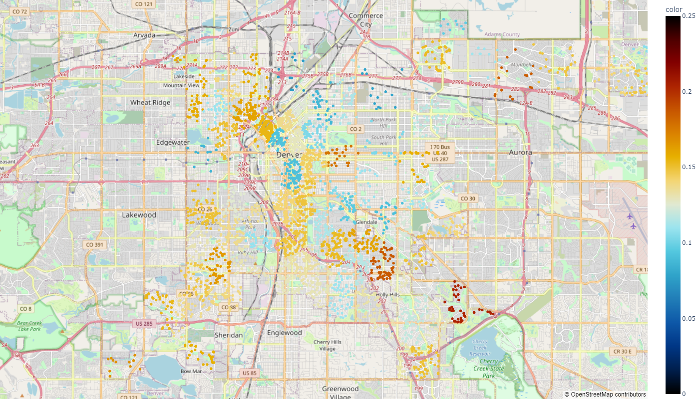
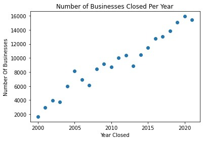
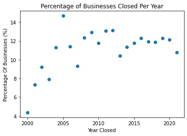
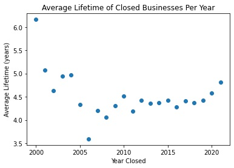

# Denver Business Closures During the Pandemic

Using the Colorado state business entity data we looked into the number, and location, of businesses that were reported closed, delinquent, or no longer in good standing with the state. We observed that there was not a large disparity in the percentage of closures compared to previous years overall, but there were specific locations that suffered more than others.

## Datasets Used

### [Business Entities in Colorado](https://data.colorado.gov/Business/Business-Entities-in-Colorado/4ykn-tg5h)

### [Denver Geotagged Addresses](https://www.denvergov.org/opendata/dataset/city-and-county-of-denver-addresses)

## Requirements
Requirements to run the notebook are stored in `requirements.txt`
```
numpy
pandas
plotly
matplotlib
scikit-learn
```
**Installation:**
```bash
pip install -r requirements.txt
```

## Notebook
The jupyter notebook shows the complete methodology of the project for analyzing the dataset as well as visualizations and explanations

## Results

\
Heatmap of business closures across the city of Denver

\
Raw number of businesses closed during the year

\
Percentage of the businesses operating that closure during the respective year 

\
The average number of years a business was operating before shutting down

